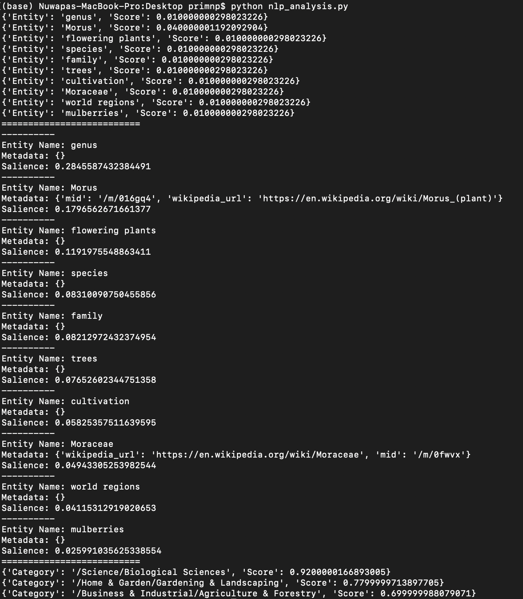

# Google NLP
## Background
[nlp_analysis.py](https://github.com/primnp/EC601_HW2/blob/main/GoogleNLP/nlp_analysis.py) is a python file which allows user to retrieve entities information, entity and sentiments analysis, and classify the content of an input text using Google NLP API.

## Installation
Follow https://cloud.google.com/natural-language/docs/setup to set up google cloud account and google NLP API. You will need to provide authentication credentials by setting the environment variable:
```
export GOOGLE_APPLICATION_CREDENTIALS="/home/user/Downloads/my-key.json"
```

## Output Example
This is an example of output retrieved from input text file of
```
Morus, a genus of flowering plants in the family Moraceae, consists of diverse species of deciduous trees commonly known as mulberries, growing wild and under cultivation in many temperate world regions.
```
All the sections are separated by =====.
The first section is entities and their respective sentiments retrieved from the input text.
The second section is entities retrieved from the input text.
The third section is the categories of content retrieved from the input text.

