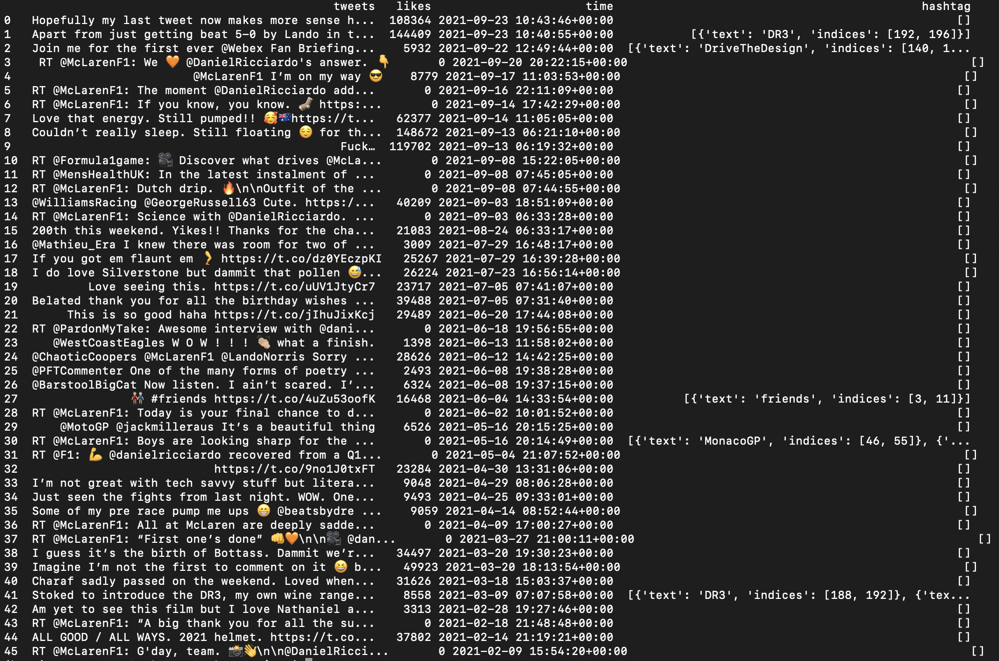

# Twitter APIs

## Background
[twitter_test.py](https://github.com/primnp/EC601_HW2/blob/main/TwitterAPI/twitter_test.py) is a python file which allows user to retrieve tweet text, number of like, time the tweet was created, and hashtag associated with the tweet. User can specify how many tweets they want to retrieve. All the data retrieved will be stored inside pandas dataframe.

User can also further manipulate dataframe to get rid of, for example, retweets (RT) and many more.

## Installation
To run twitter_test.py, user needs a Twitter developer account. With Twitter developer account, user can obtain API key, API secret, Access Key, and Access Secret needed to utilize Twitter API.

twitter_test.py uses tweepy library. Tweepy provides access to the entire twitter RESTful API methods.
User needs to install the following to use tweepy:
> pip install tweepy

In addition to tweepy, user needs to have pandas in the python path. User can install pandas using:
> pip install pandas

## Output example
This is an example of 46 tweets retrieved from @danielricciardo twitter account in dataframe format. The dataframe includes: tweets text, no of likes per tweets, time the tweets was created, and the hashtag associated with each tweets.

